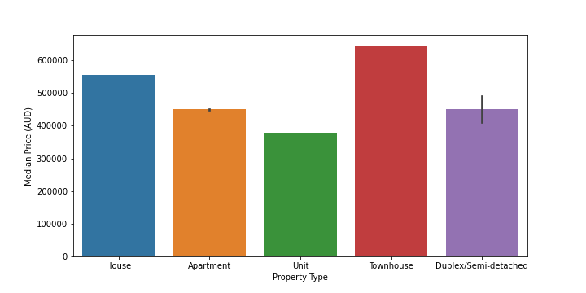
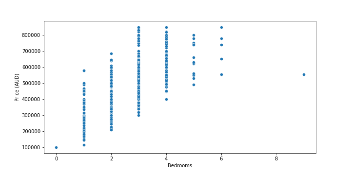

# Home in the Outback: Predicting Housing Prices in Australia

By Andrew Yang.

Potential homeowners and renters in Australia face affordability concerns about housing combined with frequent underquoting of properties in the real estate industry, which makes determining the true price of a property paramount. By using sample Australian real estate data from Kaggle to predict prices based on factors such as listing agency, room number, and property type, buyers can more accurately determine which properties they can afford. A gradient boosting model with subsampling for regression built on this data can predict housing listing price within 85,967.02 Australian dollars (AUD), and can provide a preliminary price guide for listings.

## Business Understanding

According to Statistia, housing affordability is a significant issue in Australia that has sparked many policy debates. Under 30% of Australians completely own their property, while approximately 30% of private households are composed of renters. As noted in the report, residental housing prices has typically seen strong annual growth, as have rental costs for the past decade [1]. This has led to several Australian cities such as Sydney and Auckland to be rated as some of the least affordable cities based on the ratio between housing prices and annual income [2].

Such an issue has also been compounded by the frequent practice of underquoting housing in the Australian real estate industry. Various organizations operating in the space have noted that "underquoting remains 'endemic' due to poorly regulated and underpoliced regulations". While the practice helps listers to gather more interested buyers, it also obfuscates the true price, creating much grief among hopeful buyers. As David Morrell, a buyers advocate in Australia, puts it: "It’s misleading, it’s a fraud on purchasers. And until significant penalties are handed out, regulations have been ineffective … if one does it, others have to follow" [3].

A housing price model can mitigate the issue until stronger laws punishing underquoting are passed. By estimating the price of housing through the usage of a model, buyers can more accurately determine which properties they can afford in the Australian real estate market. This saves them time searching through properties that have an unknown true price, while helping in spotting potential homes at a discount. 

## Data Understanding
The Kaggle [dataset](https://www.kaggle.com/datasets/thedevastator/australian-housing-data-1000-properties-sampled) used is a sample of 1000 Australian property listings. It contains information about the housing itself (such as size and amenities count) as well as housing type and product variation. This information can be used to specifically model prices for Australian housing based on common property aspects.

After data cleaning, outlier removal, and imputation, the cleaned data set includes 843 observations and 8 columns. Of these, seven features were chosen for modeling housing prices. Building size, land size, and property type were chosen because housing size is a key component in determining property value. Bedroom, bathroom, and parking count can also affect housing value. Lastly, product depth may have an affect on how a property is marketed: housing considered "premiere" could have higher prices than those considered "standard".

**Figure 1: Median price of dataset property types.**

**Figure 2: Relationship between bedroom count and housing prices.**

The exploratory data analysis (EDA) reveals some relationships between price and various predictors. Figure one shows that townhouses have the largest median listing price, with houses as the second most expensive property type. Meanwhile, figure two demonstrates a positive correlation between the number of bedrooms and housing price.

|   | Median | IQR |
| --- | --- | ---|
|Building Size (meters squared)|147.0|103.0
|Land Size (meters squared)|294.5|650.0|
|Price (AUD)| 485,000.0|177,500.0|
|Bedrooms|3|1|
|Bathrooms|2|1|
|Parking Spaces|2|1|

**Table 1: Descriptive statistics of numeric columns.**

|Property Type|Count|
|---|---|
|House|375|
|Unit|221|
|Apartment|192|
|Townhouse|36|
|Duplex/Semi-detached|19|

**Table 2: Frequency of property types.**

|Product Depth|Count|
|---|---|
|Premiere|563|
|Feature|154|
|Standard|126|

**Table 3: Frequency of product depths.**

In terms of descriptive statistics, table one shows the median and interquartile value of the numeric features as well as the target variable (building size, land size, price, etc); every quantitative feature possesses a right-skewed distribution. Table two and three show the frequency of various categories. 

One key limitation of the data is that the target variable (price) is based on property listings, which are subject to underquoting. It would be more accurate to model based on housing sold, but that data is not publicly availible for Australian housing. Because of that, the model will most likely predict pricing that is consistently less than the true value of the property. Additionally, the dataset is relatively small, and as such may be prone to overfitting. Managing this issue will require model regularization.

## Modeling & Evaluation

Four models were developed, using root mean squared error (RMSE) as the performance metric. In context of the issue at hand, developing models with a lower RMSE would allow buyers to more accurately determine property value by decreasing the average prediction error between the predicted and true price. Thus, the model with the lowest RMSE would be best equipped to determine the true housing price; conversely, models with high RMSE would fail to accurately predict property prices, misleading potential buyers into buying unsuitable housing or avoiding good properties. 

The first was designed to serve as a baseline by predicting housing prices at the dataset's median price of 485,000 AUD. The second was a decision tree that was optimized using Sklearn's GridSearchCV, which uses cross-validation to determine the combination of hyperparameters that leads to a model's best performance metric(s). This was followed by two gradient boosting models in order to take advantage of the model's accuracy and additional hyperparameter options. One of them was optimized using GridSearchCV, while the other used said hyperparameter optimization as well as additional subsampling to decrease housing price error.

| Model | RMSE (AUD$)|
| --- | --- |
| Baseline | 124,670.31 |
| Decision Tree | 94,997.47 |
| Gradient Boosting | 87,969.37 |
| Gradient Boosting (subsampled) | 85,967.02 |

**Table 4: Comparison of model performance on holdout test dataset.**

Based on the performance of each model, the gradient boosting model with subsampling performed the best because it held the lowest RMSE metric: on average, it predicts housing prices within 85,967.02 AUD of the true property value. Compared to the 124,670.31 AUD average error of the baseline model, it offers an approximately 31.04% accuracy improvement. By pursing lower RMSE values, potential buyers in the Australian market will be able to better approximate the true property price of housing, enabling them to make more informed decisions about housing and eventually secure a property of their own.

## Conclusion

The final model is intended to be used by people who hope to become future property owners within the Australian housing market. For many, house hunting can be both difficult and time consuming. The addition of rampant underquoting as well as rising housing prices year after year makes it crucial for buyers to find a good deal that meets their requirements. If used as intended, the model will allow potential buyers the ability to more quickly determine which homes are truly within their price range, avoiding the trap of underquoted listings, as well as discover homes at a discount, which saves them both money and time.

Still, there are various improvements possible for the model. The relatively small sample of the dataset used to develop the gradient boosting model with subsampling makes it possible that the model will perform poorly when faced with out-of-sample cases. Training the model on a larger dataset will both reduce potential issues with overfitting as well as expand the number of cases that it can handle. Additionally, as noted in a prior section, the dataset utilizes listing prices, which can be affected by the very prevalent issue of underquoting in the Australian real estate industry. Using data of sold housing would bring the models closer to their intended purpose. 

By making these adjustments, future homeowners will be able to more easily find a property they can call home until Australia can resolve its housing affordability issue.

## Repository Navigation
### Info

This repository is organized into the following components:

- **Data**: this folder contains the original dataset from Kaggle (RealEstateAU_1000_Samples.csv) as well as the data used for modeling after the data cleaning process (data_clean.csv)
- **Visualizations**: this folder contains various data visualizations created during the exploratory data analysis (EDA).
- **EDA.ipynb**: this Jupyter Notebook contains the all the data cleaning and EDA conducted during this project.
- **Models.ipynb**: this Jupyter Notebook contains all the models developed during this project.
- **Capstone.ipynb**: this notebook represents one of the final graded products of this project, including a definitive version of the data cleaning and modeling conducted during the project.
- **Presentation.pptx**: this is the presentation component of the project.

### Links

- **Original dataset:** [(https://www.kaggle.com/datasets/thedevastator/australian-housing-data-1000-properties-sampled)](https://www.kaggle.com/datasets/thedevastator/australian-housing-data-1000-properties-sampled)

- [**Capstone.ipynb**](/Capstone.ipynb)

- [**Presentation.pptx**](/Presentation.pptx)

#### Works Cited
[1] Granwal, L. *Residential housing market in Australia - statistics & facts*. Statista, 12 Dec 2022, [https://www.statista.com/topics/4987/residential-housing-market-in-australia/#topicHeader__wrapper](https://www.statista.com/topics/4987/residential-housing-market-in-australia/#topicHeader__wrapper). Accessed 2 Jan 2023.

[2] Buchholz, Katharina. *Where It’s Hardest to Afford a Home*. Statista, 21 Mar 2022, [https://www.statista.com/chart/16902/places-where-its-hardest-to-afford-a-home/](https://www.statista.com/chart/16902/places-where-its-hardest-to-afford-a-home/). Accessed 2 Jan 2023.

[3] Cassidy, Caitlin. *Underquoting in Australian real estate industry is leaving buyers feeling betrayed.* The Guardian, 26 Aug 2022. [https://www.theguardian.com/business/2022/aug/27/underquoting-in-australian-real-estate-industry-is-leaving-buyers-feeling-betrayed](https://www.theguardian.com/business/2022/aug/27/underquoting-in-australian-real-estate-industry-is-leaving-buyers-feeling-betrayed). Accessed 3 Jan 2023.

### Instructions

To reproduce the data analysis done here:

1) Download the original dataset from Kaggle, in links.
2) Run EDA.ipynb in its entirety for all the data visualizations.
3) Run Capstone.ipynb in its entirety for both data cleaning and modeling results.
